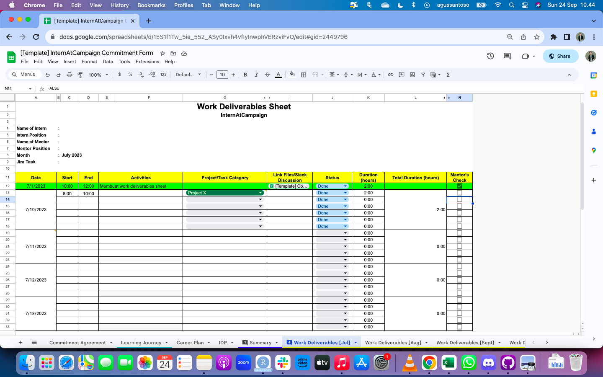
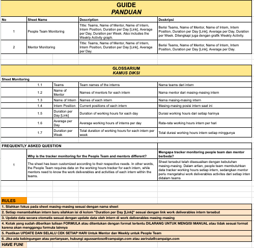
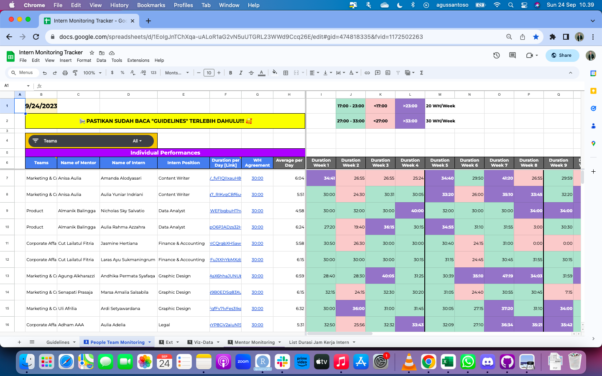
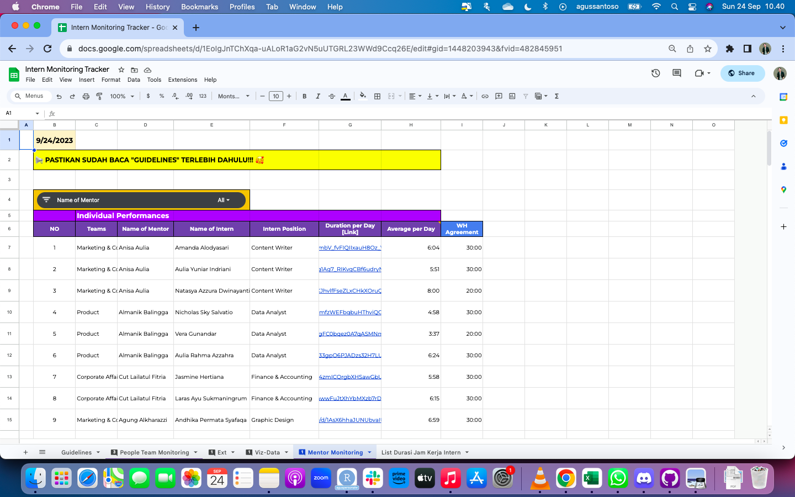
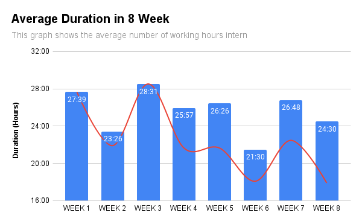

```{r setup, include=FALSE}
knitr::opts_chunk$set(echo = FALSE)
```


# Introductions

This project is undertaken due to the people team's and mentor need to track the working hours performed by the intern employees during their work activities on a weekly basis. This is to observe the performance patterns of the interns.


# What Tools To Use

- Spreadsheets


# SCQA Framework

Here's the SCQA Frameworks we use:


## Situation:
- There is a working hour regulation for interns, which is currently set at 40 hours per week.
- There is a discussion about changing the working hour regulation with two options: 30 hours per week or 15 hours per week.
- The Campaign has implemented a work deliverables sheet in the commitment form, which serves as evidence of data regarding the tasks and working hours of interns every day.

## Complication:
- The implementation of work deliverables has not been optimal due to the difficulty in monitoring, both by mentors and the people team.
- Feedback from some interns indicates that it is not very effective due to excessive administrative work, such as the obligation to fill out standup.ly and Jira tasks.
- As a result, data related to the average working hours of interns per week cannot be compiled.

## Question:
How can we monitor and track the working hours of interns along with the tasks/projects they are working on?

## Answer:
- Time/Task/Project Sheet Tracker
- Modify the existing work deliverables sheet to create a sheet/form that is visually easier for interns to fill out.
- Mentors can more easily monitor and provide feedback on a weekly/monthly basis.
- Working hour data can be pulled by the people team, ensuring that interns comply with their choice of working hours (30 or 15 hours per week).


# Preparations

Here, I want to describe a few tools in this analysis:

- Spreadsheets

- Tools/Functions we use:
  - Filtering
  - Slicer
  - Importrange
  - Formating
  - IF Functions
  - etc
  
Files : I want to know you Data files are hidden due to company secrets.


# Step and Plan


## Create Template Work Deliverables Sheet

Create a new template with modifications from the previous sheet. This template will later be duplicated by each intern, then the data in the work deliverables sheet will be pulled into the Time Sheet Tracker (people-team data center). Heres the picture Work Deliverables Sheet Template.

<center>{width="50%"}</center>


## TimeSheet Monitoring Tracker

Create a TimeSheet Monitoring Tracker (Central Data). In the time sheet tracker there will be 4 sections:

- Guidlines: Contains How to Use the TimeSheet Monitoring Tracker

<center>{width="50%"}</center>

- People Team Monitoring: Contains a total recap of internal work deliverables such as total working hours per week per intern.

<center>{width="50%"}</center>

- Mentor Monitoring: Recap of internal work deliverables per team, to make it easier for mentors to check without having to open internal deliverables one by one.

<center>{width="50%"}</center>

- Data-Viz: To see a graph of the development of internal working hours.

<center>{width="50%"}</center>


## Trial and Error

After the work deliverables sheets and TimeSheet Monitoring Tracker are created, we carry out the next step, namely by Trial & Error to finding out of the best way to reach a desired result or a correct solution by trying out one or more ways or means and by noting and eliminating errors or causes of failure.


## Evaluations
Evaluation needs to be carried out to assess or calculate the quality of the TimeSheet Monitoring Tracker that we have developed. We can do this with all the data that has been collected since TimeSheet Monitoring Tracker was used.


## Finalization

In the last step we finalize it after all the steps have been carried out and the TimeSheet Monitoring Tracker can be used properly.

