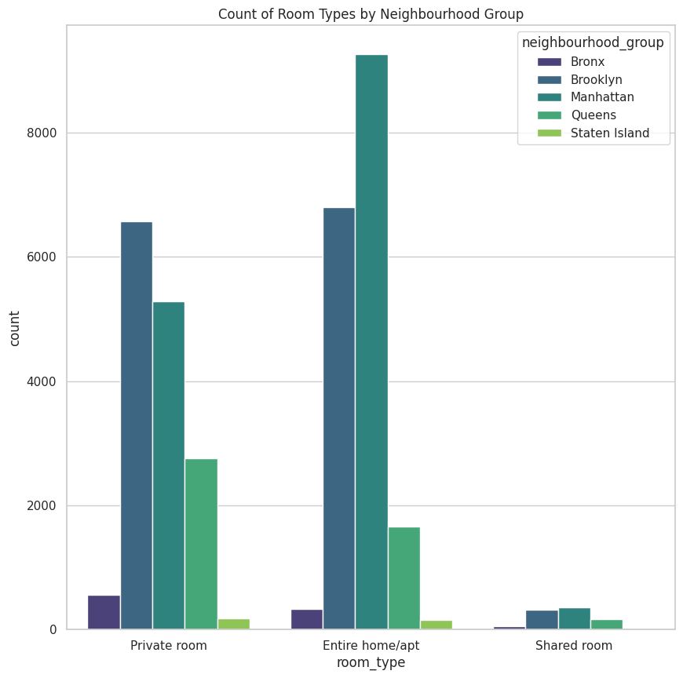
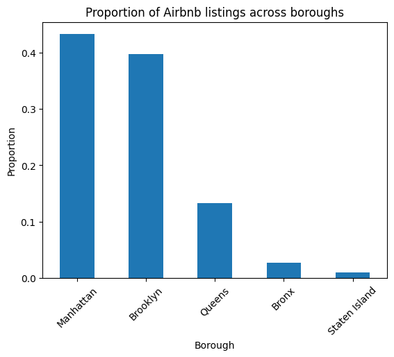
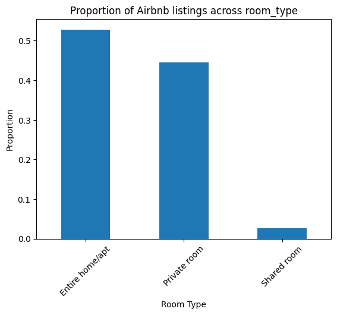
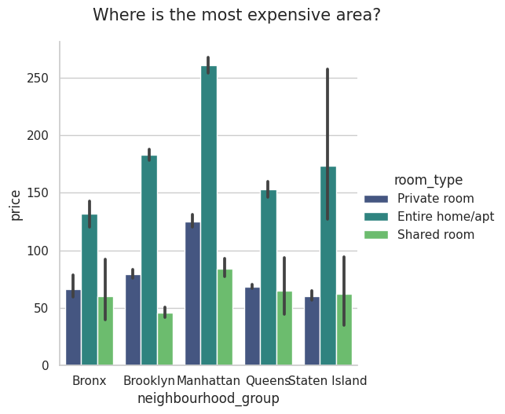
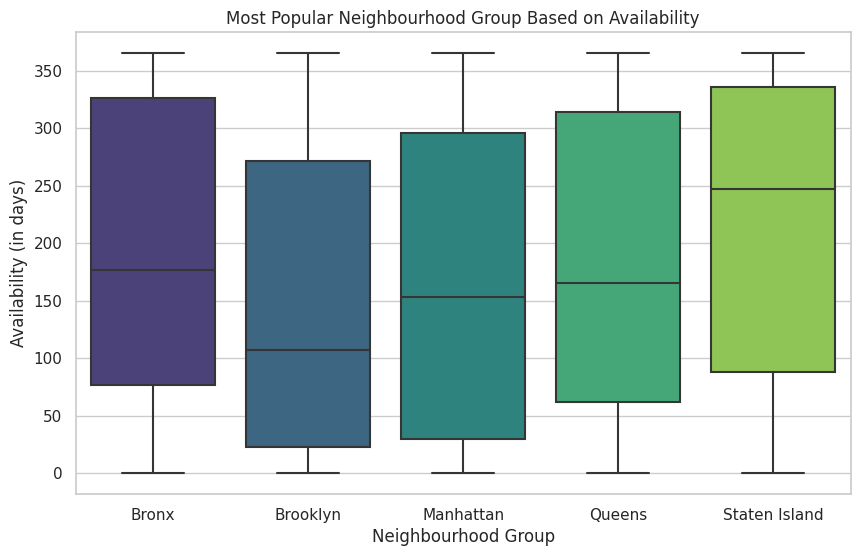
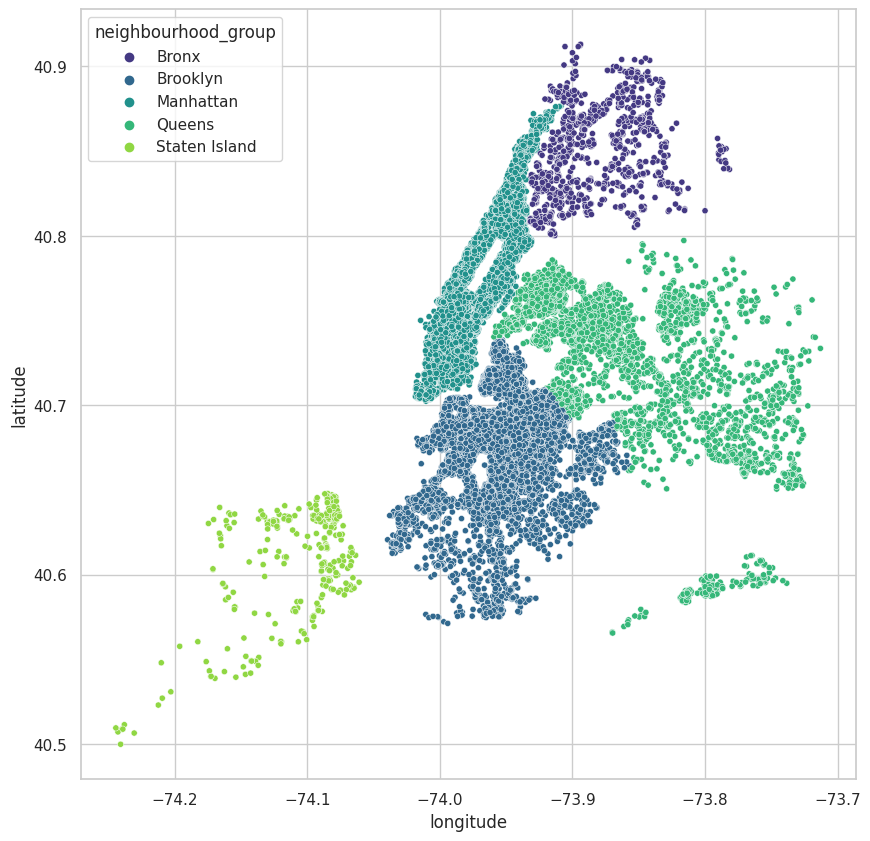
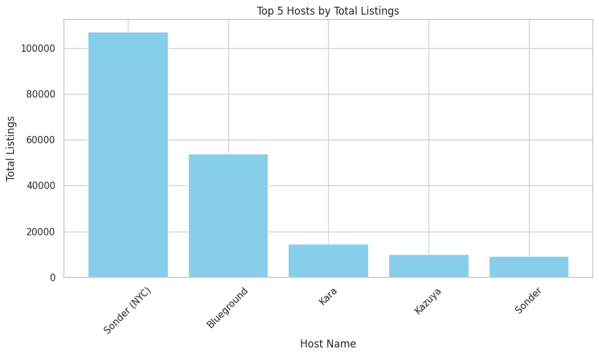

```{r setup, include=FALSE}
knitr::opts_chunk$set(echo = FALSE)
```


# Introductions

This personal project is a case study given by RevoU in a mini course held for 2 weeks to see the participants' understanding of the Data Analytics material that has been presented, therefore I tried to make several analyzes of this Airbnb which is a marketplace that connects people who renting out houses to people looking for a place to stay.


# What Tools To Use

- Google Colaboratory
- Python


# Summary

<center>{width=auto}</center>

Airbnb is an online marketplace that connects people who want to rent out their homes with people looking for accommodations in specific locales. The company has come a long way since 2007, when its co-founders first came up with the idea to invite paying guests to sleep on an air mattress in their living room. According to Airbnb's latest data, it now has more than 7 million listings, covering some 100,000 cities and towns in 220-plus countries and regions worldwide.


# Exploratory Data Analytics

## Preparation

- Google Colaboratory
- Import Libraries Python: *pandas*, *numpy*, *matplotlib*
- This public [dataset](https://www.kaggle.com/datasets/dgomonov/new-york-city-airbnb-open-data) is part of Airbnb, This is New York City Airbnb Open Data from [Dgomonov](https://www.kaggle.com/dgomonov/datasets).


## Connect with the data

<details>

<summary><b>Connect the data</b></summary>

The first step is that we have to make sure our data is connected.

```{python, Step1 Connect with data, eval=FALSE, echo=TRUE, message=FALSE, warning=FALSE, paged.print=FALSE}
# Connect with dataset in drive
from google.colab import drive
drive.mount("/content/drive")
```

</details>

## Import and Reading Data

<details>

<summary><b>Import libraries</b></summary>

Import libraries we need to use, like:

```{python, Step2 Import libraries, eval=FALSE, echo=TRUE, message=FALSE, warning=FALSE, paged.print=FALSE}
import pandas as pd
import numpy as np
import matplotlib.pyplot as plt
import seaborn as sns
import random as random
import random
from datetime import datetime, timedelta
import plotly.express as px
import warnings
```

</details>

<details>

<summary><b>Read the data</b></summary>

Read the data

```{python, Step3 Read the data, eval=FALSE, echo=TRUE, message=FALSE, warning=FALSE, paged.print=FALSE}
# Read the data
df = pd.read_csv("/content/drive/MyDrive/dataset nyc airbnb/AB_NYC_2019.csv")
```

</details>


## Data Understandings

<details>

<summary><b>Basic data understandings</b></summary>

This is basic data understandings like:

- *DataFrame* : *df.*
- *shape* : *df.shape()*
- *head* : *df.head()*
- *info* : *df.info()*
- *describe* : *df.describe()*

</details>


## Data Processing


<details>

<summary><b>Informations of Dataset</b></summary>

In the first step of data processing we can use several database understandings to see an overview of the dataset to data type information and check for the duplicates values.

```{python, Step4 View the data, eval=FALSE, echo=TRUE, message=FALSE, warning=FALSE, paged.print=FALSE}
df.head() # View the data
df.describe() # View the descriptive statistics or overview the dataset
df.info() # View the info from data like data type and others
print(df.shape) # Provide the number of rows and columns in the dataset
list(df) # View list of column names
df.drop_duplicates() # Check for the duplicates values
df.shape
print(df.isnull().sum()) # Print the number of null values in each column
```
</details>

<details>

<summary><b>Fixing Error</b></summary>

Second step is fixing error form the data

- Change the data type if something is wrong

```{python, Step5 Change the data type, eval=FALSE, echo=TRUE, message=FALSE, warning=FALSE, paged.print=FALSE}
# Change the data type from object to date
df['last_review'] = pd.to_datetime(df['last_review'])
df['review_year'] = df['last_review'].apply(lambda last_review:last_review.year)
df['review_year'] = df['review_year'].fillna(0)
df['review_year'] = df.review_year.astype(int)
df = pd.concat([df[(df['availability_365']==0) & (df['review_year']==2019)],df[df['availability_365']>0]])
```

- Replace missing values

```{python, Step6 Replace missing values, eval=FALSE, echo=TRUE, message=FALSE, warning=FALSE, paged.print=FALSE}
#Replace the missing value with 0
df['reviews_per_month'] = df['reviews_per_month'].fillna(0)
```

- Check again the data info

```{python, Step7 data info, eval=FALSE, echo=TRUE, message=FALSE, warning=FALSE, paged.print=FALSE}
df.info()
```

- Fixing again if there is still something you want to fix
here i want to drop data last_review and eplace the missing 'name' values by random name.

```{python, Step8 drop some column, eval=FALSE, echo=TRUE, message=FALSE, warning=FALSE, paged.print=FALSE}
# Drop the 'last_review' column
df.drop('last_review', axis=1, inplace=True)

# Replace the missing 'name' values by random name
df = df.fillna({'name': 'Upper East Side Oasis!'}) # here i fill with 'Upper East Side Oasis!'
df = df.fillna({'host_name': 'john'}) # here i fill with 'john'
```

- View the dataset
view the dataset with df.head() and df.info() and check too dataset isnull.

```{python, Step9 view dataset, eval=FALSE, echo=TRUE, message=FALSE, warning=FALSE, paged.print=FALSE}
df.head()
df.info()
print(df.isnull().sum())
```
</details>

<details>

<summary><b>Design Visualizations</b></summary>

- Heatmap Correlations

Correlation heatmaps are here to show us how closely related variables are.

```{python, Viz1 heatmap correlations, eval=FALSE, echo=TRUE, message=FALSE, warning=FALSE, paged.print=FALSE}
plt.figure(figsize=(12,12))
sns.heatmap(df.corr(), cmap='Blues', annot=True,)
plt.show()
```

- Count of Room Types by Neighbourhood Group

To see room type by neighbourhood group

```{python, Viz2 count room type by neighbourhood group, eval=FALSE, echo=TRUE, message=FALSE, warning=FALSE, paged.print=FALSE}
# Create the count plot
plt.figure(figsize=(10, 10))
sns.set(style="whitegrid")
# Create a count plot with 'room_type' on the x-axis and hue='neighbourhood_group'
sns.countplot(data=df, x='room_type', hue='neighbourhood_group', palette='viridis')
plt.title('Count of Room Types by Neighbourhood Group')
# Show the plot
plt.show()
```

- Bar plot

To shows Proportion of Airbnb listings across boroughs and room type.

```{python, Viz3 bar plot, eval=FALSE, echo=TRUE, message=FALSE, warning=FALSE, paged.print=FALSE}
# Create a bar plot borough
(df['neighbourhood_group'].value_counts() / df.shape[0]).plot.bar(cmap='tab10', title='Proportion of Airbnb listings across boroughs')
plt.xlabel('Borough')
plt.ylabel('Proportion')
plt.xticks(rotation=45)
plt.show()

# Create a bar plot room type
(df['room_type'].value_counts() / df.shape[0]).plot.bar(cmap='tab10', title='Proportion of Airbnb listings across room_type')
plt.xlabel('Room Type')
plt.ylabel('Proportion')
plt.xticks(rotation=45)
plt.show()
```

- Most Expensive

To see where is the most expensive area?

```{python, Viz4 Most Expensive Area, eval=FALSE, echo=TRUE, message=FALSE, warning=FALSE, paged.print=FALSE}
# Create the bar plot
fig = sns.catplot(x='neighbourhood_group', y='price', data=df, kind='bar', hue='room_type', palette='viridis')
# Add a title and adjust its position
fig.fig.suptitle('Where is the most expensive area?', fontsize=15, y=1.05)
# Save the plot as an image with tight layout
fig.savefig('most_expensive_area.png', bbox_inches='tight')
```

- Popular area?

To see where is the most popular area based on availability?

```{python, Viz5 Most Popular Area Based on Availability, eval=FALSE, echo=TRUE, message=FALSE, warning=FALSE, paged.print=FALSE}

# Create the bar plot
plt.figure(figsize=(10, 6))
sns.set(style="whitegrid")
# Sort the DataFrame by 'availability_365' in descending order
df_sorted = df.sort_values(by='availability_365', ascending=False)
# Create the bar plot
sns.boxplot(data=df_sorted, x='neighbourhood_group', y='availability_365', palette='viridis')
plt.xlabel('Neighbourhood Group')
plt.ylabel('Availability (in days)')
plt.title('Most Popular Neighbourhood Group Based on Availability')
# Show the plot
plt.show()
```

- Map Box

Next, we can visualize it using a box map to see the distribution.

```{python, Viz6 Map Box, eval=FALSE, echo=TRUE, message=FALSE, warning=FALSE, paged.print=FALSE}

# Visualize Map Box with scatterplot
plt.figure(figsize=(10,10))
sns.scatterplot(x='longitude', y='latitude', hue='neighbourhood_group',s=20, data=df, palette="viridis")
```

- Top 5 Host Listing

To see who the top 5 by calculated_host_listings_count

```{python, Viz7 top 5 host listing, eval=FALSE, echo=TRUE, message=FALSE, warning=FALSE, paged.print=FALSE}
# Calculate total reviews per host
total_host_listings_count = df.groupby('host_name')['calculated_host_listings_count'].sum()
# Rank hosts by total listings count
ranked_hosts = total_host_listings_count.sort_values(ascending=False)
# Top 5 host_names based on total listings count
top_5_host_names = ranked_hosts.head(5)
# Display the top 5 host_names
print(top_5_host_names)

# Create a bar plot to visualize the top 5 host_names by total listings
plt.figure(figsize=(10, 6))
plt.bar(top_5_host_names.index, top_5_host_names.values, color='skyblue')
plt.xlabel('Host Name')
plt.ylabel('Total Listings')
plt.title('Top 5 Hosts by Total Listings')
plt.xticks(rotation=45)
plt.tight_layout()

# Show the plot
plt.show()
```

</details>


## Visualizations and Analysis

### Heatmaps Correlations
A correlation heatmap is a graphical representation of a correlation matrix representing the correlation between different variables. The value of correlation can take any value from -1 to 1. Correlation between two random variables or bivariate data does not necessarily imply a causal relationship. We can see it as in ***Fig. 2*** below 👇


### Count of Room Types by Neighbourhood Group
To create an analysis of this, we first collected data from Airbnb listings and created Airbnb areas based on neighborhood groups such as: Manhattan, Bronx, Brooklyn, Queens, and Staten Island. We then calculated three main room types: Whole house/apartment, Shared room, and Private room in each neighborhood group. We can see the details in ***Fig. 3.***



The results indicate that Manhattan has the highest number of Entire home/apt listings, reflecting its popularity as a tourist destination. Brooklyn follows closely behind, offering a mix of room types. In contrast, the Bronx, Queens, and Staten Island have a higher proportion of Entire home/apt and Private rooms, likely due to their residential nature.


### Proportion of Airbnb listings across boroughs and room_type
This is Breakdown from Count of Room Types by Neighbourhood Group

#### Proportion of Airbnb listings across boroughs
In this analysis, we explore the distribution of Airbnb listings across the five major boroughs of New York City: Manhattan, Bronx, Brooklyn, Queens, and Staten Island. We can see details in ***Fig. 4.***



Regarding boroughs in this graph ***Fig. 4.***, Manhattan and Brooklyn have the highest proportions of Airbnb listings, reflecting their status as top tourist destinations. Queens also boasts a significant number of listings, while the Bronx offers a more affordable alternative. Staten Island, with its suburban appeal, has the smallest share of Airbnb listings among the five boroughs. 

#### Proportion of Airbnb listings across room_type
In addition to region, We explored the Airbnb listing distribution of three room types in New York City: Entire home/apt, Private room, and Shared room. We can see details in ***Fig. 5.***



In terms of room types, Airbnb listings in New York City predominantly comprise "Entire home/apt" options, catering to those seeking privacy and convenience. "Private room" listings come next, offering a balance between affordability and comfort. "Shared room" listings are the least common, serving budget-conscious solo travelers or those comfortable sharing living spaces.


### Where The Most Expensive Area?
To analyze the data, we first gathered information on rental prices for these room types in each borough. Afterward, we calculated the average rental price for each combination of borough and room type. Here are the findings:

**Manhattan:** Unsurprisingly, Manhattan emerges as the most expensive borough overall, with entire homes/apartments being the costliest, followed by private rooms and shared rooms.

**Bronx:** In the Bronx, shared rooms are the most affordable option, followed by private rooms and entire homes/apartments.

**Brooklyn:** Brooklyn exhibits a similar pattern to Manhattan, with entire homes/apartments being the most expensive, followed by private rooms and shared rooms.

**Queens:** Queens generally offers more affordable accommodations compared to Manhattan and Brooklyn. Entire homes/apartments are the priciest, followed by private rooms and shared rooms.

**Staten Island:** Staten Island, being the least expensive of the five boroughs, sees private rooms as the most economical choice, followed by shared rooms and entire homes/apartments.

To visualize these findings, we've created bar graphs below that represent the average rental prices for each borough and room type. These graphs will help you better understand the price distribution across the different areas and accommodation types. We can see details in ***Fig. 6.***



Please note that the specific rental prices can vary greatly within each borough, and this analysis provides a general overview. If you have access to the relevant data, you can create more detailed analyses and visuals to dive deeper into the specific neighborhoods and factors influencing rental prices in each area.


### Most Popular Neighbourhood Group Based On Availability?

The box plot analysis depicts the availability of Airbnb listings in the five major boroughs of New York City (Manhattan, Bronx, Brooklyn, Queens, and Staten Island). The 'availability_365' metric is used to measure the availability of listings throughout the year. We can see the details in ***Fig. 7.***



Looking at the above categorical box plot we can infer that the listings in State Island seems to be more available throughout the year to more than 300 days. On an average, these listings are available to around more 250 days every year followed by Bronx where every listings are available for around more 150 on an average every year.


### Let’s also see Map Box Distributions



Mapbox distribution in New York City shows varying levels of usage across the five boroughs: Manhattan, Bronx, Brooklyn, Queens, and Staten Island. In Manhattan, where the bustling heart of the city resides, Mapbox is likely to see high utilization, with its mapping and location services catering to the demands of businesses, tourists, and residents alike.


### Top 5 Host Listing
To find Top 5 hosts by total listings count.



As we can find that Top 5 host name are Sonder (NYC), Blueground, Kara, Kazuya, and Sonder.


## Conclusion

- The results indicate that Manhattan has the highest number of Entire home/apt listings, reflecting its popularity as a tourist destination. Brooklyn follows closely behind, offering a mix of room types. In contrast, the Bronx, Queens, and Staten Island have a higher proportion of Entire home/apt and Private rooms, likely due to their residential nature.

- We can infer that there are high range of prices across Manhattan followed by Brooklyn and Queens being the most costliest place to stay in NYC.

- Understanding these proportions can assist travelers in selecting accommodations that suit their preferences and budgets.


## Observations

Manhattan has the highest number of Entire home/apt listings, reflecting its popularity as a tourist destination. Brooklyn follows closely behind, offering a mix of room types. Then Manhattan have more expensive places to stay in NYC. Room availability is very low in manhattan and brooklyn and you can find a room anytime in the State Island and Bronx.

## Recomendations

If you are looking for the most expensive locations you can come to Manhattan and Brooklyn or Queens. However, if you want to find the places with the highest availability in New York City, you can choose a location like the Bronx with an average of more than 150 days every year or State Island with an average of more than 250 days available every year.


<center> **THANK YOU 🙌** </center>

