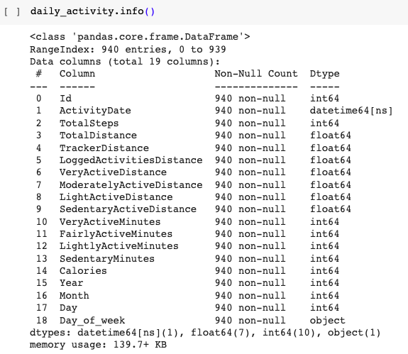

```{r setup, include=FALSE}
knitr::opts_chunk$set(echo = FALSE)
```


# Introductions
### Scenario
Welcome to the Bellabeat data analysis case study! In this case study, I will perform many real-world tasks of a junior data analyst. I will imagine I am working for Bellabeat, a high-tech manufacturer of health-focused products for women, and meet different characters and team members. In order to answer the key business questions, you will follow the steps of the data analysis process: ***ask, prepare, process, analyze, share, and act.***

<center>{width=auto}</center>

I am a junior data analyst working on the marketing analyst team at Bellabeat, a high-tech manufacturer of health-focused products for women. Bellabeat is a successful small company, but they have the potential to become a larger player in the global smart device market. Urška Sršen, cofounder and Chief Creative Officer of Bellabeat, believes that analyzing smart device fitness data could help unlock new growth opportunities for the company. I have been asked to focus on one of Bellabeat’s products and analyze smart device data to gain insight into how consumers are using their smart devices. The insights I discover will then help guide marketing strategy for the company. I will present your analysis to the Bellabeat executive team along with your high-level recommendations for Bellabeat’s marketing strategy.


# What Tools To Use

- Google Colaboratory
- Python


# Exploratory Data Analytics

- Google Colaboratory
- Import Libraries Python: *pandas*, *numpy*, *matplotlib*, *etc.*
- This public [dataset in here](https://www.kaggle.com/datasets/arashnic/fitbit)


## Connect with the data

<details>

<summary><b>Connect the data</b></summary>

The first step is that we have to make sure our data is connected.

```{python, Step1 Connect with data, eval=FALSE, echo=TRUE, message=FALSE, warning=FALSE, paged.print=FALSE}
#Connect google colab with my drive
from google.colab import drive
drive.mount("/content/drive")
```

</details>


## Import and Reading Data

<details>

<summary><b>Import libraries</b></summary>

Import libraries we need to use, like:

```{python, Step2 Import libraries, eval=FALSE, echo=TRUE, message=FALSE, warning=FALSE, paged.print=FALSE}
#import libraries all we need
import pandas as pd
import numpy as np
import matplotlib.pyplot as plt
import seaborn as sns
import random as random
import plotly.graph_objects as go
from plotly.offline import iplot
from plotnine.data import economics
from plotnine import ggplot, aes, geom_line
import warnings
```
</details>

<details>

<summary><b>Read the data</b></summary>

Read the data

```{python, Step3 Read the data, eval=FALSE, echo=TRUE, message=FALSE, warning=FALSE, paged.print=FALSE}
#import the data we use
daily_activity  = pd.read_csv("/content/drive/MyDrive/Fitabase Dataset/dailyActivity_merged.csv")
daily_calories = pd.read_csv("/content/drive/MyDrive/Fitabase Dataset/dailyCalories_merged.csv")
sleep_day  = pd.read_csv("/content/drive/MyDrive/Fitabase Dataset/sleepDay_merged.csv")
weight_log_info  = pd.read_csv("/content/drive/MyDrive/Fitabase Dataset/weightLogInfo_merged.csv")
```
</details>


## Data Understandings

<details>

<summary><b>Basic data understandings</b></summary>

This is basic data understandings like:

- *DataFrame* : *df.*
- *shape* : *df.shape()*
- *head* : *df.head()*
- *info* : *df.info()*
- *describe* : *df.describe()*

</details>


## Data Processing

<details>

<summary><b>Informations of Dataset</b></summary>

In the first step of data processing we can use several database understandings to see an overview of the dataset to data type information and check for the duplicates values.

***Breakdown the data to make analysis easier***

- Daily Activity Dataset

```{python, Step4 View the data, eval=FALSE, echo=TRUE, message=FALSE, warning=FALSE, paged.print=FALSE}
daily_activity.head() # View the data
daily_activity.describe() # View the descriptive statistics or overview the dataset
ddaily_activity.info() # View the info from data like data type and others
print(daily_activity.shape) # Provide the number of rows and columns in the dataset
list(daily_activity) # View list of column names
daily_activity.drop_duplicates() # Check for the duplicates values
daily_activity.shape
print(daily_activity.isnull().sum()) # Print the number of null values in each column
```

</details>

<details>

<summary><b>Fixing Error</b></summary>

Second step is fixing error form the data

- Change the data type if something is wrong

Fixing Error from data type ActivityDay --> from object to date
```{python, Step5 Change the data type, eval=FALSE, echo=TRUE, message=FALSE, warning=FALSE, paged.print=FALSE}
#Change the data type from object to date
daily_activity['ActivityDate'] = pd.to_datetime(daily_activity['ActivityDate'])
```

- Create/Adding New Columns 

```{python, Step5 Adding column, eval=FALSE, echo=TRUE, message=FALSE, warning=FALSE, paged.print=FALSE}
# Create year column
daily_activity['Year'] = daily_activity['ActivityDate'].dt.year

# Create month column
daily_activity['Month'] = daily_activity['ActivityDate'].dt.month

# Create day column
daily_activity['Day'] = daily_activity['ActivityDate'].dt.day

# Create day_of_week column
daily_activity['Day_of_week'] = daily_activity['ActivityDate'].dt.day_name()
```

- Check again the data info

```{python, Step7 data info, eval=FALSE, echo=TRUE, message=FALSE, warning=FALSE, paged.print=FALSE}
daily_activity.info()
daily_activity.head()
```

check the information after change data type and adding the data with daily_activity.info() and daily_activity.head(). Details like the image below.

<center>{width=auto}</center>

*Noted: Do the same for daily_calories, sleep_day, and weight_log_info adjusted to the dataset. If all the required datasets have been prepared and processed, you can proceed to the next step.*

</details>


<details>

<summary><b>Design Visualizations</b></summary>

- Heatmap Correlations

```{python, Viz1 heatmap correlations, eval=FALSE, echo=TRUE, message=FALSE, warning=FALSE, paged.print=FALSE}
plt.figure(figsize=(14,14))
sns.heatmap(daily_activity.corr(), cmap='Greens', annot=True,)
plt.show()
```

- Average Activity Minutes

```{python, Viz2 Average Activity Minutes, eval=FALSE, echo=TRUE, message=FALSE, warning=FALSE, paged.print=FALSE}
# List of activity types to calculate the mean for
activity_types = ['VeryActiveMinutes', 'FairlyActiveMinutes', 'LightlyActiveMinutes', 'SedentaryMinutes']

# Calculate the average values for each activity type across all days
average_activity = daily_activity[activity_types].mean()

# Create labels and values for the pie chart
activity_labels = average_activity.index
activity_minutes = average_activity.values

# Create the pie chart
plt.figure(figsize=(8, 8))
plt.pie(activity_minutes, labels=activity_labels, autopct='%1.1f%%', startangle=140)
plt.title('Average Activity Minutes')
plt.show()
```

- Total Very Active Minutes During Each Day

```{python, Viz3 Total Very Active Minutes During Each Day, eval=FALSE, echo=TRUE, message=FALSE, warning=FALSE, paged.print=FALSE}
# Create a specific order for days of the week
days_order = ['Monday', 'Tuesday', 'Wednesday', 'Thursday', 'Friday', 'Saturday', 'Sunday']

# Group and sum the Very Active Minutes for each day
veryactive_minutes = daily_activity.groupby('Day_of_week').agg({'VeryActiveMinutes': 'sum'}).reindex(days_order).reset_index()

# Set the figure size
a1 = (8, 6)
fig, ax = plt.subplots(figsize=a1)

# Create the bar plot
plot = sns.barplot(x="Day_of_week", y="VeryActiveMinutes", data=veryactive_minutes, palette="deep")

# Rotate x-axis labels for better readability
plot.set_xticklabels(ax.get_xticklabels(), rotation=90)

# Set the title and labels
plot.set_title('Total Very Active Minutes by Days')
ax.set_ylabel('Total VeryActiveMinutes Sum')
ax.set_xlabel('Days')
```

- Total Sedentary Minutes During Each Day

```{python, Viz4 Total Sedentary Minutes During Each Day, eval=FALSE, echo=TRUE, message=FALSE, warning=FALSE, paged.print=FALSE}
# Create a specific order for days of the week
days_order = ['Monday', 'Tuesday', 'Wednesday', 'Thursday', 'Friday', 'Saturday', 'Sunday']

# Group and sum the SedentaryMinutes for each day
sedentary_minutes = daily_activity.groupby('Day_of_week').agg({'SedentaryMinutes': 'sum'}).reindex(days_order).reset_index()

# Set the figure size
a1 = (8, 6)
fig, ax = plt.subplots(figsize=a1)

# Create the bar plot
plot = sns.barplot(x="Day_of_week", y="SedentaryMinutes", data=sedentary_minutes, palette="deep")

# Rotate x-axis labels for better readability
plot.set_xticklabels(ax.get_xticklabels(), rotation=90)

# Set the title and labels
plot.set_title('Total Sedentary Minutes by Days')
ax.set_ylabel('Total SedentaryMinutes Sum')
ax.set_xlabel('Days')
```

- Total Steps

```{python, Viz5 Total step, eval=FALSE, echo=TRUE, message=FALSE, warning=FALSE, paged.print=FALSE}
# Create a specific order for days of the week
days_order = ['Monday', 'Tuesday', 'Wednesday', 'Thursday', 'Friday', 'Saturday', 'Sunday']

# Group and sum the TotalSteps for each day
totalsteps_days = daily_activity.groupby('Day_of_week').agg({'TotalSteps': 'sum'}).reindex(days_order).reset_index()

# Set the figure size
a1 = (8, 6)
fig, ax = plt.subplots(figsize=a1)

# Create the bar plot
plot = sns.barplot(x="Day_of_week", y="TotalSteps", data=totalsteps_days, palette="deep")

# Rotate x-axis labels for better readability
plot.set_xticklabels(ax.get_xticklabels(), rotation=90)

# Set the title and labels
plot.set_title('Total Steps by Days')
ax.set_ylabel('Total Steps Sum')
ax.set_xlabel('Days')
```

- Total Distance During Each Day

```{python, Viz6 Total Distance During Each Day, eval=FALSE, echo=TRUE, message=FALSE, warning=FALSE, paged.print=FALSE}
# Create a specific order for days of the week
days_order = ['Monday', 'Tuesday', 'Wednesday', 'Thursday', 'Friday', 'Saturday', 'Sunday']

# Group and sum the TotalDistance for each day
sedentary_minutes = daily_activity.groupby('Day_of_week').agg({'TotalDistance': 'sum'}).reindex(days_order).reset_index()

# Set the figure size
a1 = (8, 6)
fig, ax = plt.subplots(figsize=a1)

# Create the bar plot
plot = sns.barplot(x="Day_of_week", y="TotalDistance", data=sedentary_minutes, palette="deep")

# Rotate x-axis labels for better readability
plot.set_xticklabels(ax.get_xticklabels(), rotation=90)

# Set the title and labels
plot.set_title('Total Distance by Days')
ax.set_ylabel('Total Distance Sum')
ax.set_xlabel('Days')
```

- Total Steps and Total Distance by Day of Week

```{python, Viz7 Total Steps and Total Distance by Day of Week, eval=FALSE, echo=TRUE, message=FALSE, warning=FALSE, paged.print=FALSE}

# Create a figure and the primary y-axis
fig, ax1 = plt.subplots(figsize=(10, 6))
sns.barplot(x='Day_of_week', y='TotalSteps', data=daily_activity, label='Total Steps', color='skyblue', ax=ax1)

# Calculate a scaling factor for Total Distance
total_distance_max = daily_activity['TotalDistance'].max()
scaling_factor = daily_activity['TotalSteps'].max() / total_distance_max

# Plot Total Distance (scaled) on the secondary y-axis
daily_activity['TotalDistance_scaled'] = daily_activity['TotalDistance'] * scaling_factor
sns.barplot(x='Day_of_week', y='TotalDistance_scaled', data=daily_activity, label='Total Distance', color='salmon', ax=ax1)

# Customize the plot
plt.title('Total Steps and Total Distance by Day of Week')
ax1.set_xlabel('Day of Week')
ax1.set_ylabel('Count')
plt.grid(True)

# Show the plot
plt.tight_layout()
plt.show()
```

- Relationship between Total Steps and Calories

```{python, Viz8 Relationship between Total Steps and Calories, eval=FALSE, echo=TRUE, message=FALSE, warning=FALSE, paged.print=FALSE}
# Create a scatter plot using Seaborn
plt.figure(figsize=(10, 6))
sns.scatterplot(data=daily_activity, x="TotalSteps", y="Calories", hue="SedentaryMinutes", palette="coolwarm", alpha=0.7)
plt.xlabel("Total Steps")
plt.ylabel("Calories")
plt.title("Relationship between Total Steps and Calories")
plt.grid(True)

# Add a regression line (similar to geom_smooth in ggplot2)
sns.regplot(data=daily_activity, x="TotalSteps", y="Calories", scatter=False, color="gray")

plt.show()
```

- Total Minutes A Sleep During Each Day

```{python, Viz9 Total Minutes A Sleep During Each Day, eval=FALSE, echo=TRUE, message=FALSE, warning=FALSE, paged.print=FALSE}
sd_days = sleep_day.groupby('Day_of_week').agg({'TotalMinutesAsleep':'sum'}).reset_index().sort_values('TotalMinutesAsleep',ascending = False)

a1 = (8, 6)
fig, ax = plt.subplots(figsize=a1)
plot= sns.barplot(x="Day_of_week", y="TotalMinutesAsleep", data=sd_days,palette ="deep")
plot.set_xticklabels(ax.get_xticklabels(),rotation=90)
plot.set_title('Total Minutes A Sleep During Each Day')
ax.set_ylabel('Total Minutes A Sleep')
ax.set_xlabel('Days')
```

- Percentage of People in Each BMI Category

```{python, Viz10 Percentage of People in Each BMI Category, eval=FALSE, echo=TRUE, message=FALSE, warning=FALSE, paged.print=FALSE}
# Define BMI categories based on thresholds
def categorize_bmi(bmi):
    if bmi < 18.5:
        return 'Underweight'
    elif 18.5 <= bmi < 24.9:
        return 'Healthy Weight'
    elif 25 <= bmi < 29.9:
        return 'Overweight'
    else:
        return 'Obese'

# Apply the categorization to the BMI column
weight_log_info['BMI Category'] = weight_log_info['BMI'].apply(categorize_bmi)

# Calculate the percentage of individuals in each BMI category
category_counts = weight_log_info['BMI Category'].value_counts(normalize=True) * 100

# Create a pie chart or a bar chart
plt.figure(figsize=(8, 8))
plt.pie(category_counts, labels=category_counts.index, autopct='%1.1f%%', startangle=140)
plt.title('Percentage of People in Each BMI Category')
plt.axis('equal')  # Equal aspect ratio ensures the pie chart is circular.

# Show the chart
plt.show()
```

- Weight Distribution (Kg)

```{python, Viz11 Weight Distribution (Kg), eval=FALSE, echo=TRUE, message=FALSE, warning=FALSE, paged.print=FALSE}
# Histogram for WeightKg
plt.figure(figsize=(10, 6))
sns.histplot(data=weight_log_info, x='WeightKg', bins=20, kde=True)
plt.title('Weight Distribution (Kg)')
plt.xlabel('Weight (Kg)')
plt.ylabel('Frequency')
plt.show()
```


</details>


## Visualizations and Analysis

### Heatmaps Correlations
A correlation heatmap is a graphical representation of a correlation matrix representing the correlation between different variables. The value of correlation can take any value from -1 to 1. Correlation between two random variables or bivariate data does not necessarily imply a causal relationship. We can see it as in ***Fig. 3*** below 👇


### Average Actvity Minutes

The pie chart displays the distribution of active minutes across four categories: Very Active Minutes, Fairly Active Minutes, Lightly Active Minutes, Sedentary Minutes. We can see it as details in ***Fig. 4*** below.


The data extracted from the pie chart concerning average activity minutes paints a striking picture of user habits. It becomes immediately apparent that the vast majority of users, approximately 81.3%, tend to spend a substantial portion of their daily routines in sedentary minutes activities. This is a significant concern as prolonged periods of inactivity can have adverse effects on overall health. Conversely, the chart also reveals a rather alarming statistic: a mere 1.7% of users actively engage in very active minutes.


### Total Very Active Minutes During Each Day

In our analysis of the Bellabeat dataset, we examined the distribution of 'Very Active Minutes' across different days of the week.


This analysis provides valuable insights into user behavior and engagement patterns. It is evident that users tend to accumulate more 'Very Active Minutes' during weekdays, with Tuesday standing out as the days when users are most active. This may suggest that users prioritize physical activity during the early part of the week. Interestingly, the activity level starts to decline as we progress towards the weekend, with Friday and Sunday showing lower 'Very Active Minutes' on average but saturday but Fridays seeing a slight increase.


### Total Sedentary Minutes During Each Day

The bar chart displays the distribution of Sedentary Minutes. We can see it as details in ***Fig. 6*** below.


The graph, our findings reveal an interesting trend where users tend to have higher 'Sedentary Minutes' during weekdays, with Tuesday showing the highest levels of sedentary behavior. This pattern may be indicative of typical workweek routines, where individuals spend prolonged periods sitting at desks or engaging in less active tasks. As the week progresses, there is a decline in sedentary behavior until the end of the week.


### Total Steps

The bar graph shows that the highest total steps were on Tuesday and decreased towards the weekend, but there was a jump on Saturday and decreased again on Sunday. We can see it as details in ***Fig. 7*** below.


### Total Distance During Each Day and Total Steps with Total Distance by Day of Week

The bar graph show with Total Distance highest on Tuesday. We can see it as details in ***Fig. 8*** below.


The bar graph show with Total Distance and Total Steps During Each Day. 


### Relationship between Total Steps and Calories Burned

In our exploration of the Bellabeat dataset, we uncovered a fascinating relationship between 'Total Steps' and 'Calories Burned.' While the conventional wisdom suggests that more steps lead to more calories burned, our analysis revealed a counter intuitive trend. We observed that certain users, classified as sedentary due to their minimum step count, were still able to burn a significant number of calories, often falling within the range of 1500 to 2500 calories. In contrast, some more active users, who took significantly more steps, burned calories in a similar range. We can see it as details in ***Fig. 10*** below.


In this case we assume the possibility exists that factors beyond step count, such as metabolism, basal metabolic rate, or the intensity of activities, play a substantial role in calorie expenditure.


### Total Minutes A Sleep During Each Day

The bar graph show with Total Minutes A Sleep During Each Day highest on Wednesday. We can see it as details in ***Fig. 11*** below.


### Percentage of People in Each BMI Category

Within our dataset by randomly adding the contents of the ***'Fat'*** column we obtained,

```{python, Adding Data Fat, eval=FALSE, echo=TRUE, message=FALSE, warning=FALSE, paged.print=FALSE}

Fixing Error with Missing Values (NaN)
Notes: The NA value is detected in the Fat section. I am going to fill the NA values based on the avaliable ones.

weight_log_info['Fat'].value_counts()
22.0    1
25.0    1
Name: Fat, dtype: int64

#Replace the missing 'Fat' values by values between 22 and 25
weight_log_info['Fat'] = weight_log_info['Fat'].apply(lambda x: random.randint(22, 25))

weight_log_info['Fat'].value_counts()
output
23    21
22    16
24    16
25    14
Name: Fat, dtype: int64
```

output, 23 = 21 column, 22 = 16 column, 24 = 16 column, 25 = 14 column. We can see it as details in ***Fig. 12*** below.


Within our dataset, a noteworthy observation emerges: a majority of individuals, comprising 50.7%, are classified as being within the healthy weight range. This percentage is notably higher than the 47.8% of individuals categorized as overweight and the 1.5% who fall into the obese category. We can see it as details in ***Fig. 13*** below.


This data underscores a compelling opportunity for health promotion initiatives aimed at encouraging and facilitating individuals to achieve and maintain a healthy weight. Such initiatives can play a pivotal role in enhancing overall public health by reducing the prevalence of overweight and obesity, both of which are associated with various health risks and conditions.


### Weight Distribution

In our analysis of the Bellabeat dataset, we generated a histogram to gain insights into the distribution of weights among users, as represented by the 'WeightKg' variable. The histogram provides a visual representation of the frequency or count of individuals falling within different weight ranges. We can see it as details in ***Fig. 14*** below.


Upon examination, we observed a bell-shaped distribution, suggesting that the majority of users have weights clustered around a central value. This central tendency in weight is a common characteristic of populations, with most individuals maintaining weights close to the average.

Furthermore, the histogram revealed that the dataset includes a range of weights, from the lower end to the higher end of the scale. This diversity in weight distribution is essential for tailoring health and fitness recommendations to address the unique needs of individuals with varying weight profiles.

Overall, the 'WeightKg' histogram serves as a valuable tool for understanding the weight distribution within the dataset and can inform strategies for promoting and supporting healthy weight management among users.


## Conclusion

This analysis provides valuable insights into user behavior and engagement patterns.

- In 'Very Active Minutes' it is clear that users tend to accumulate more 'Very Active Minutes' during weekdays, with Tuesday standing out as the days when users are most active. This may suggest that users prioritize physical activity during the early part of the week.

- In our exploration, we uncovered a fascinating relationship between 'Total Steps' and 'Calories Burned.' While the conventional wisdom suggests that more steps lead to more calories burned, our analysis revealed a counter intuitive trend. We observed that certain users, classified as sedentary due to their minimum step count, were still able to burn a significant number of calories, often falling within the range of 1500 to 2500 calories.

- Within our dataset, a noteworthy observation emerges about Percentage of People in Each BMI Category: a majority of individuals, comprising 50.7%, are classified as being within the healthy weight range. This percentage is notably higher than the 47.8% of individuals categorized as overweight and the 1.5% who fall into the obese category.


## Observations

The Bellabeat dataset is a comprehensive health and fitness dataset that includes fitness tracking, sleep patterns, total steps, calories, even weight. This makes it a valuable resource for individuals who want to make informed decisions about their health.

## Recomendations

Bellabeat has the capability to notify users regarding their inactive lifestyle through either the mobile app or directly on the fitness tracker. Given that a significant 81.3% of users do not currently utilize the device for monitoring their health routines, this data could prove highly valuable for devising effective marketing strategies.


<center> **THANK YOU 🙌** </center>


