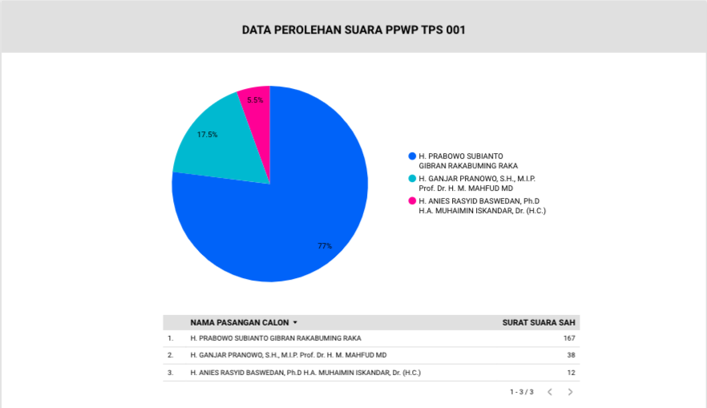
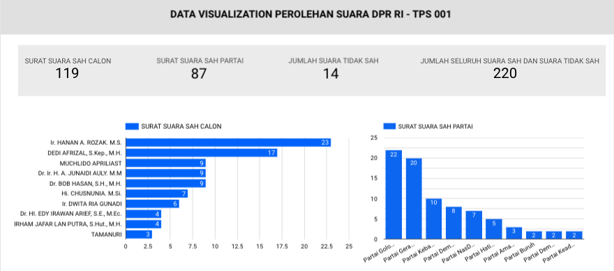
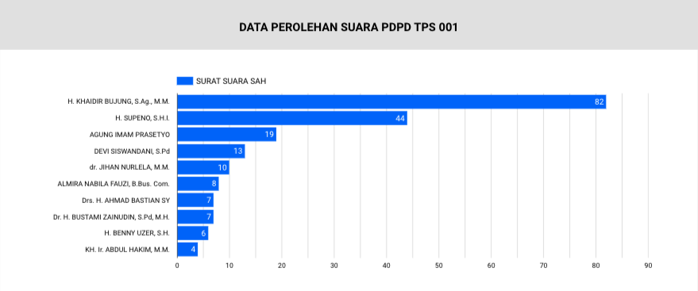
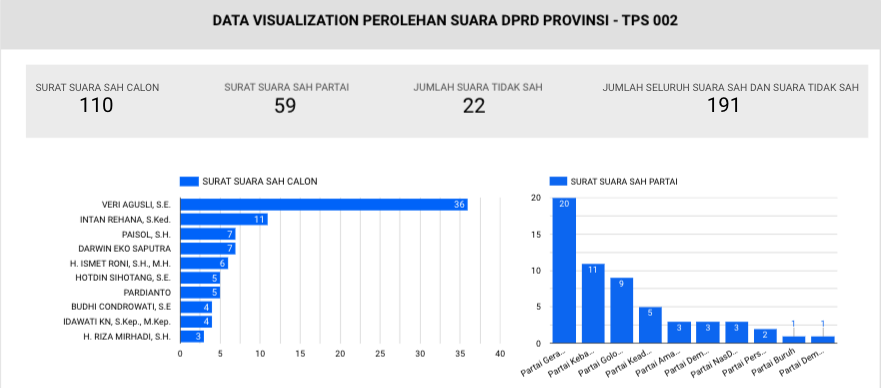
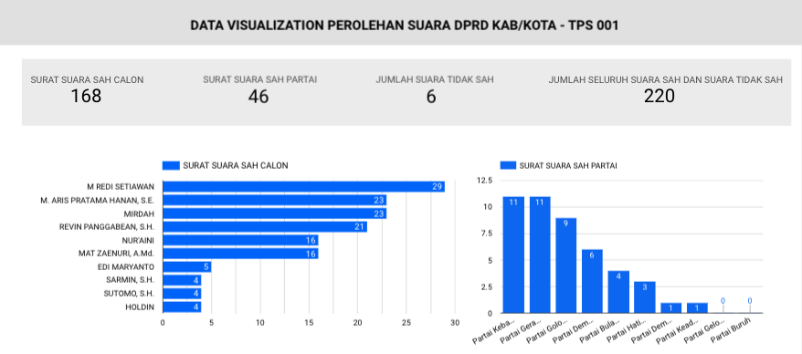

```{r setup, include=FALSE}
knitr::opts_chunk$set(echo = FALSE)
```


## Introductions

In response to the need for timely and transparent information regarding the 2024 General Election in Bujung Sari Marga Village, the creation of the Election Dashboard has been initiated. This interactive platform aims to provide residents with up-to-date data and insights into the election process, enabling them to monitor results and analyze voting trends after the counting process is completed. The user-friendly interface is designed to facilitate active community engagement in the democratic process at the local level.


## What Tools To Use

- Looker Studio
- Spreadsheets


## Preparations

Here, I want to describe a few tools in this analysis:

- Connect the data from Spreadsheets to Looker Studio

- Tools/Functions we use:
  - Filtering
  - Tabular Data
  - Data Viz
  - etc
  
  
## Visualizations and Analysis
Data visualization on the dashboard is seamlessly presented through intuitive graphs, charts, and interactive visual elements. These visual representations offer a clear and comprehensive view of the 2024 General Election data for Bujung Sari Marga Village. Users can easily interpret trends, analyze voting patterns, and gain valuable insights, fostering a deeper understanding of the electoral dynamics within the community.
The dashboard categorizes data into five distinct types of votes, starting from the Presidential and Vice Presidential (PWP) election, followed by the House of Representatives (DPR RI), Regional Representative Council (DPD), Provincial Legislative Council (DPRD-Provinsi), and District/City Legislative Council (DPRD-Kabupaten/Kota), providing a detailed breakdown of the electoral process.


### Dashboard Presidential and Vice Presidential (PWP) Election
The dashboard provides a detailed analysis of votes cast for the Presidential and Vice Presidential candidates, offering insights into the preferences and trends shaping the leadership choices within Bujung Sari Marga Village. We can see it as [dashboard details](https://lookerstudio.google.com/reporting/0ecbd21b-6e6f-44f7-8968-9db0494af136/page/IIcqD) and preview in ***Fig. 1*** below.




### Dashboard House of Representatives (DPR RI)
Users can explore the data related to the election of representatives to the national House of Representatives, allowing for a comprehensive understanding of the political landscape and representation preferences at the national level. We can see it as [dashboard details](https://lookerstudio.google.com/reporting/31ee50f2-14e0-4c8b-a9e9-300ebaba6764/page/p_rrb75boned) and preview in ***Fig. 2*** below.




### Dashboard Regional Representative Council (DPD)
The dashboard highlights the voting patterns for the Regional Representative Council, providing valuable insights into the community's choices for representatives at the regional level. We can see it as [dashboard details](https://lookerstudio.google.com/reporting/c8e04eb1-44f8-4399-b68f-9c0db17061ce/page/HacqD) and preview in ***Fig. 3*** below.




### Dashboard Provincial Legislative Council (DPRD-Provinsi)
Detailed visualizations on the dashboard illustrate the electoral dynamics for the Provincial Legislative Council, offering a breakdown of votes and preferences at the provincial level. We can see it as [dashboard details](https://lookerstudio.google.com/u/0/reporting/96740d84-6da0-4c03-b735-46e3768b8521/page/p_rrb75boned) and preview in ***Fig. 4*** below.




### Dashboard District/City Legislative Council (DPRD-Kabupaten/Kota)
For a localized perspective, the dashboard presents a comprehensive breakdown of votes for the District/City Legislative Council, enabling residents to examine the choices and trends in their specific administrative areas. We can see it as [dashboard details](https://lookerstudio.google.com/reporting/d556b2c1-663d-4447-9939-765a80a07a10/page/p_rrb75boned) and preview in ***Fig. 5*** below.




## Conclusion
As we conclude this interactive journey through the 2024 General Election Dashboard for Bujung Sari Marga Village, we invite you to explore the rich tapestry of data and insights it offers. The breakdown of votes across the five categories, from the Presidential and Vice Presidential election to the District/City Legislative Council, provides a nuanced understanding of our community's democratic choices. This platform is not just a tool for post-election analysis but a testament to our commitment to transparency and informed civic participation. As we navigate through the visualizations, may we gain a deeper appreciation for the diverse voices that shape our local democracy. Your engagement with this dashboard contributes to the collective knowledge and strengthens the foundation of our shared democratic values. Thank you for being an active participant in shaping the future of Bujung Sari Marga Village.


<center> **THANK YOU 🙌** </center>


