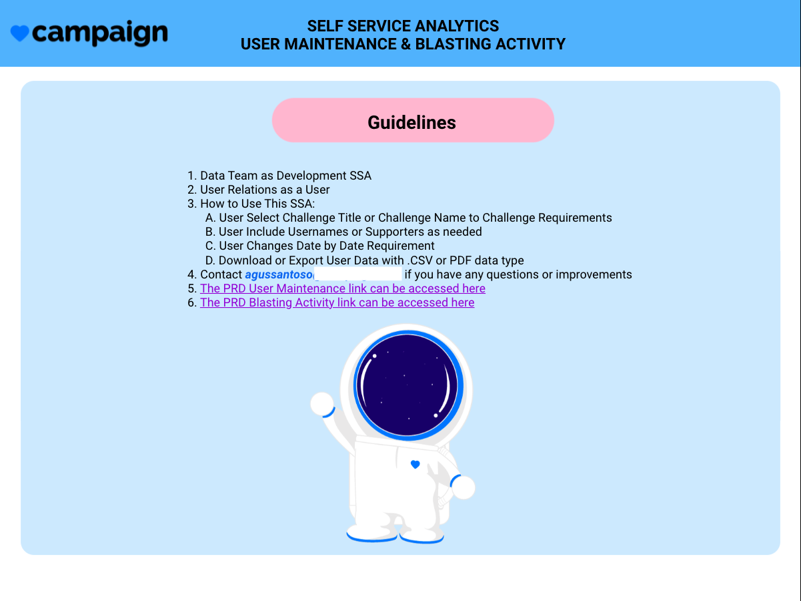
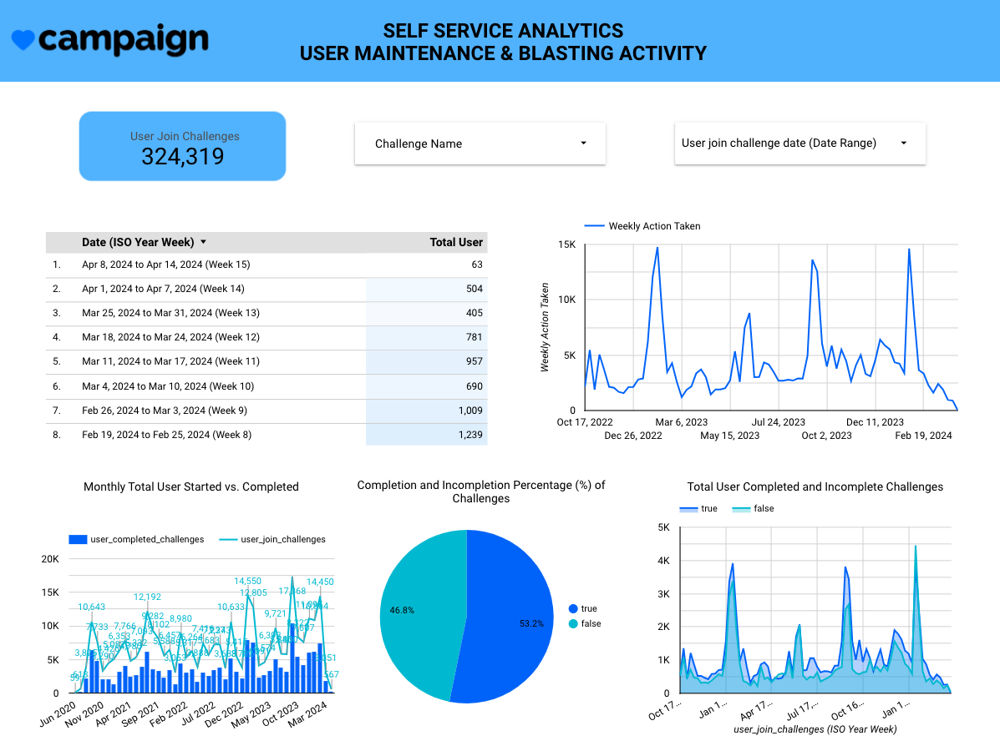
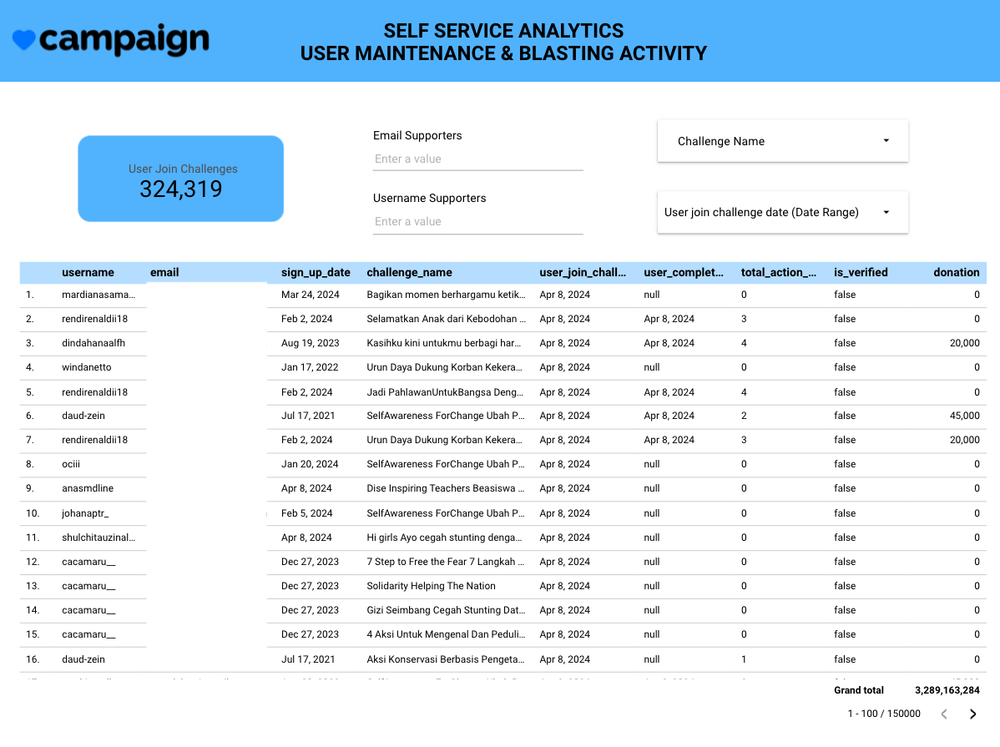
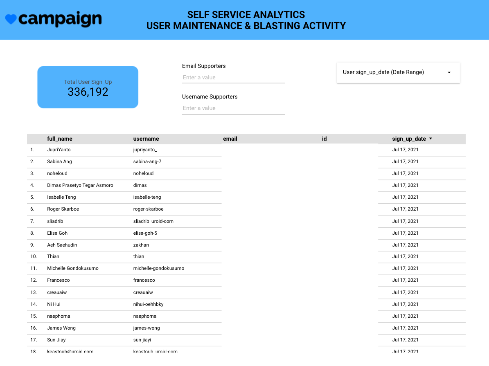
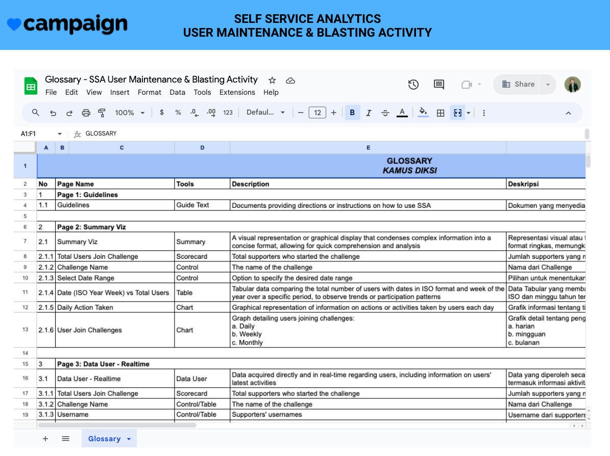

```{r setup, include=FALSE}
knitr::opts_chunk$set(echo = FALSE)
```


## Introductions

In our current workflow, data updates are managed weekly by the Data Team, utilizing a spreadsheet and Slack channel for distribution. This decentralized process places a heavy reliance on the Data Team's workload, hindering efficiency and timely decision-making. Addressing this challenge is crucial to expedite our business decisions. Thus, the question arises: How can we streamline routine tasks to enhance efficiency and accessibility for stakeholders? It's worth noting that the need for user maintenance data is crucially required by the User Relations Team, intensifying the urgency for a solution. The answer lies in implementing a Self-Service Analytics (SSA) platform. SSA offers an autonomous solution, enabling users to independently gather and analyze data, thereby facilitating quicker decision-making processes.


## What Tools To Use

- Looker Studio / Google Data Studio
- MySQL
- DBeaver
- Google Sheet / Spreadsheet


## Preparations

Here, I want to describe a few tools in this analysis:

- Connect the data from MySQL to Looker Studio with Custom Query

- Tools/Functions we use:
  - Filtering
  - Tabular Data
  - Data Viz
  - Embed Report
  - etc
  

## Dashboard Visualizations
The dashboard consists of five unique pages, each with a specific name and function to enhance data understanding and decision-making.

### Guideline Page: 
This page serves as a general guide for using the dashboard, providing instructions and tips for navigation, as well as further understanding of the presented data. We can see it as a preview in ***Fig. 1*** below.




### Realtime - Summary Viz:
This page presents brief visualizations of real-time data related to user activities and drilling, allowing stakeholders to quickly grasp the big picture. We can see it as a preview in ***Fig. 2*** below.



### Realtime - Tabular Data User:
On this page, real-time tabular data related to users is presented, enabling stakeholders to directly examine detailed data. We can see it as a preview in ***Fig. 3*** below.



### Detail - Profile User
This page displays detailed profiles of users, including their history, and providing deeper insights into specific users. We can see it as a preview in ***Fig. 4*** below.



### Glossary:
This page serves as a reference for stakeholders to understand the terms and concepts used in the dashboard. We can see it as a preview in ***Fig. 5*** below.



Each page in the dashboard has been carefully designed to meet specific analytical needs, empowering stakeholders with actionable insights and facilitating data-driven decision-making.


## Conclusions

The development of our dashboard has culminated in a powerful tool for data-driven decision-making, offering comprehensive insights into user maintenance and blasting activities. Through meticulous design and implementation, we have achieved several key outcomes:

- ***Enhanced Visibility and Accessibility:*** The dashboard provides stakeholders with a centralized platform to access real-time data, improving visibility into key metrics and trends related to user maintenance and blasting activities.

- ***Improved Efficiency and Productivity:*** By streamlining routine tasks and providing intuitive visualizations, the dashboard empowers stakeholders to make quicker and more informed decisions, ultimately enhancing efficiency and productivity across the organization.

- ***Deeper Understanding and Analysis:*** With detailed profiles and comparative analytics, stakeholders can gain a deeper understanding of user behavior and operational performance, facilitating targeted interventions and optimization strategies.

- ***Facilitated Collaboration and Communication:*** The dashboard serves as a common ground for stakeholders to collaborate and communicate effectively, fostering alignment and synergy in decision-making processes.

***In conclusion***, our dashboard represents a significant step forward in leveraging data analytics to drive organizational success. Moving forward, we will continue to iterate and improve upon the dashboard, ensuring it remains a valuable asset in our quest for continuous improvement and excellence.


<center> **THANK YOU 🙌** </center>