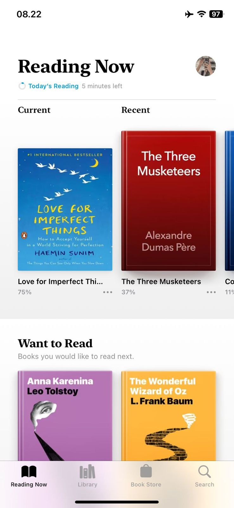

Welcome to my personal website! I currently work as a Data Analyst at Campaign.com, where I specialize in extracting actionable insights from datasets. Practiced experience in data cleaning, visualization, and analysis with Spreadsheet, Excel, SQL, and Tableau. You can also see more about my background on my resume:

### Short Bio
Agus Santoso is an Data Analyst at Campaign.com. His project focus on understanding how consumer preferences are based on app growth. Agus holds a B.Sc in physics from the Faculty of Mathematics and Natural Sciences at Sumatera Institute of Technology.

### College Life

I began studying Physics at ITERA as an undergraduate in the mid of 2017. I work as an assistant in practicum and lessons in Material Processing class for 1 month. This provides an opportunity to increase my communication & presenting skills in front of at least 21 practitioner 

During the thesis, I choose to work on Material Physics. It was developing materials ZnO:Al Thin Layers to Solar Cell Application. Then, this project was presented at my lecture for final exam before graduation. 

### Books as a hobby
{width=auto .external}

I always read books wherever I am. Books has a power to transport you to the authors world and away from the monotonous daily routine. Reading a variety of topics helps me to be more knowledgeable person, in turn improving my conversation skills.

Thanks for visiting my personal website, don't hesitate to give a feedback you may have!

Best,

Agus